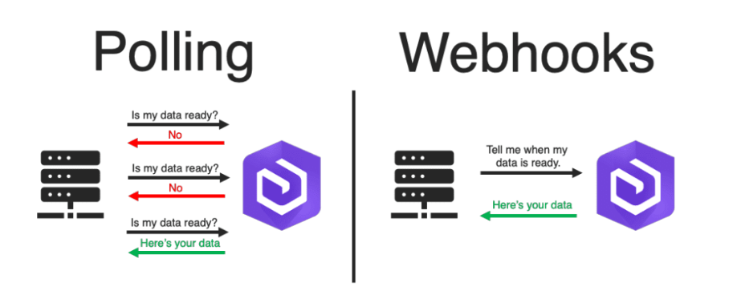
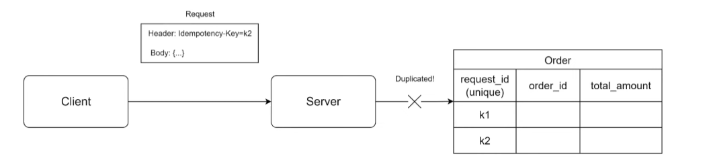

# REST API Design

> This is the take-note of the [TechTalk](https://youtu.be/y0KvnoVnqjA?si=FDbMj6sf_oOP3Mwe) organized by Ronin Engineer.

## 1. HTTP Methods

### 1.1. Properties

- **Safety**: do not alter the server state/data.
- **Idempotency**: A same request will has the same result.

|  HTTP Method  | Safety    |Idempotency| Operations                        |
|---            |---        | ---       | ---                               |
| `GET`           | Yes       | Yes       | Read                              |
| `HEAD`          | Yes       | Yes       | Like GET but only return Headers. |
| `OPTIONS`       | Yes       | Yes       | Describes the communication options |
| `TRACE`         | Yes       | Yes       | Test loop-back for testing of debugging method. |
| `PUT`           | No        | Yes       | Update Totally                    |
| `DELETE`        | No        | Yes       | Delete or Disable                 |
| `POST`          | No        | No        | Create                            |
| `PATCH`         | No        | No        | Update Partiallyu                 |

## 2. RESTful API Conventions

- Use Nouns Instead of Verbs. `/clients` **not** `/getClients`
- Plural Nouns. Example: `/clients/?client-id`
- Use Nesting to show Relationships.
- Slug-case for URL: `https://vienct-blog.com` **not** `https://vienct_blog.com`
- Snake_case for request, response body.
- Versioning: `/cpe/v1/user`

## 3. Pagination

- Page & size parameter: `/user?page=0%size=10`
  - Use case: management protal.
  - Must document: page start counting with 0 or 1.
- Offset & limit parameters: `/user?offset=0&limit=10`
  - Use case: a infinite scrollable list, newsfeed, logging envents, a scan for data, ...

### Problem 01

2 problems with this situation:

- Performance issue for large dataset in relational DB:
  - Take time to count all rows.
- Resource Skipping:
  - First get page 1, delete X records in page 1 the get page 2 -> X first records in page 2 moved to page 1.

**Solution**:

- Cursor: `SELECT * FROM users WHERE id > last_id ORDER BY id LIMIT 10`.
- Deferred join:

```sql
SELECT * FROM
(SELECT id FROM users ORDER BY id LIMIT 100, 10) a USING id
JOIN users b ON a.id = a.id;
```

## 4. Sorting

- GET `/products?sort=price:asc,name:desc`
- GET `/products?sort=+price,-name`
- White list of sortable fields.

## 5. Relations using slashes

- **One-To-Many**
  - Get all comments of an article 123: GET `/articles/123/comments`
- **Many-To-Many**
  - Get students in a class: GET `/classes/<class_id>/students`
  - Add students into a class: POST `/classes/<class_id>/students/<student_id>`
  - Add students into a class: POST `/classes/<class_id>/students` with body is:

```json
{
    "student_ids":["s1","s2","s3"]
}
```

## 6. Use cases

### 6.1. Design API for exporting a file with the size of 500MB

#### 6.1.1. Process

- Query BD.
- Write file.
- Response file to client.

#### 6.1.2. Issues

- Request timeout, latency (Connection's poblem).
- Client is blocked (Client's problem).
- Out of memory (Server's problem).
- Large result of the query (DB's problem).

#### 6.1.3. Solution

##### Async API

**Example:**

1. API request to export data: GET `/products/jobs/export?name=pen`

```json
"job_id": "001", //id, uuid...
"status": "PROCESSING", //status of the job
"issued_at": 1696690531 //unix timestamp
```

2. API check status: GET `/jobs/001`

```json
"job_id": "001", //id, uuid...
"status": "DONE", //status of the job
"issued_at": 1696690531 //unix timestamp
"updated_at": 1696690535 //unix timestamp
```

3. API get job result: GET `/job/001/result`

##### Types of Async API

> Types in Async API: Polling or Callback/Webhook



- **Polling:**
  - Easy to Implement
  - Waste resource
  - Use case: small load, import/export file, small model.
- **Callback/Webhook:**
  - Optimize the resource.
  - Complex to implement in both client side and server side.
  - Use case: large load, payment, big model.

### 6.2. A request might be sent twice due to the network or replay attack

#### Solution:

- Client generates and adds an Idempotency Key to the request's header.
- Server checks Idempotency Key with unique constraint in DB.



## 7. A good API Document...

- Sample document (prodive by ***System Design VN*** And **Ronin Engineer**): [REST_API_Document.pdf](sample_document/REST_API_Document.pdf)

- Describe request, response body clearly.
- Show all errors and their meanings.
- Nice to have cURL sample.